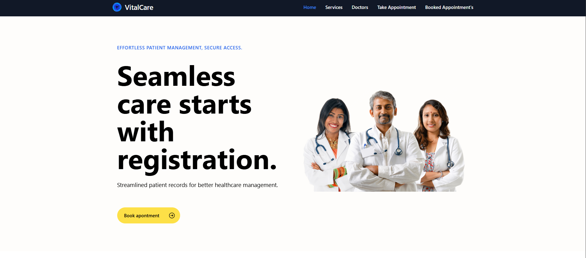

# vitalcare
## Preview

## Project Overview:

**VitalCare** The Patient Appointment System is a simple yet effective web-based application used to scheduling and managing appointments

### Key Features:
- **Book Appointments**: Patients can schedule appointments with their preferred doctors or specialists.
- **View Booked Appointments**: Patients can easily access a list of their previously scheduled appointments, including details like date, time, and doctor’s name.

## Technologies Used
- **Frontend**: React, Tailwind CSS, React Router DOM
- **Backend**: Express, nodejs
- **Database**: mongodb
- **Package Manager**: NPM

## Author

- [@Bibek samal](https://github.com/Bibek-only)

